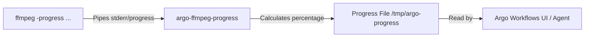

# Transcoder 🎬

[](https://github.com/kevinastone/transcoder/actions/workflows/ci.yaml)
[](https://opensource.org/licenses/MIT)
[](https://nixos.org)

A minimal, fully reproducible, and highly optimized OCI container image for `ffmpeg` built with Nix. It is specifically designed for containerized cloud workflows (like Argo Workflows) and supports multi-architecture (`linux/amd64` and `linux/arm64`) deployments.

---

## 📖 Table of Contents

- [Overview](#overview)
- [Key Features](#key-features)
- [How It Works](#how-it-works)
- [Repository & Container Utilities](#repository--container-utilities)
- [Usage Examples](#usage-examples)
  - [Using `argo-ffmpeg-progress`](#using-argo-ffmpeg-progress)
  - [Argo Workflows Integration](#argo-workflows-integration)
- [Local Development](#local-development)
  - [Nix DevShell](#nix-devshell)
  - [Building the Image](#building-the-image)
  - [Debugging Layer Efficiency](#debugging-layer-efficiency)
  - [Code Formatting](#code-formatting)
- [CI/CD & Publishing](#cicd--publishing)

---

## 🔍 Overview

This repository uses Nix Flakes to build deterministic, minimal OCI images containing `ffmpeg` and the `argo-ffmpeg-progress` utility. By leveraging Nix, we eliminate extra system libraries, keeping the final container lightweight, secure, and reproducible. The resulting image is ideal for cloud-native transcoding pipelines.

---

## ⚡ Key Features

- **Minimal & Secure**: Built using Nix's `dockerTools`, packaging only `ffmpeg`, a few dependencies (`bash`, `jq`, `coreutils`, `gawk`), and the progress tracker script. No package manager or unnecessary base-image clutter.
- **Multi-Architecture Support**: Built and published for both `linux/amd64` and `linux/arm64`.
- **Seamless Argo Workflows Integration**: Features an integrated stream parser to format transcoding progress updates for Argo's UI.
- **Reproducible Environment**: Pins dependency versions via Nix Flakes, ensuring the build is identical every time.

---

## 🛠️ How It Works

`argo-ffmpeg-progress` consumes the `-progress` stream of `ffmpeg` via standard input, calculates the percentage completed based on the total video duration, and outputs it to a specified file.



---

## 📁 Repository & Container Utilities

Utilities defined in [nix/scripts](file:///Users/kstone/Documents/transcoder/nix/scripts) serve different roles within the container and development environment:

### Packaged in the Container Image
- **`argo-ffmpeg-progress`**: The only utility packaged directly into the final container image. It reads `ffmpeg`'s progress updates from `stdin`, converts the current processed time to a percentage, and writes `<percent>/100` to a target file.

### Development & CI Utilities (Not in the Image)
- **`push-multiarch`**: A CI helper script used to assemble and push multi-architecture OCI manifests (for `amd64` and `arm64`) using `regctl`.
- **`dive-archive`**: A local development helper script loaded by `nix develop` to run `dive` on built container tarballs.

---

## 🚀 Usage Examples

### Using `argo-ffmpeg-progress`

To log the transcoding progress of a 120-second video into `/tmp/argo-progress`:

```bash
ffmpeg -i input.mp4 \
  -c:v libx264 \
  -progress >(argo-ffmpeg-progress 120 /tmp/argo-progress) \
  output.mp4
```

### Argo Workflows Integration

In an Argo Workflows template, you can capture progress tracking by specifying the `progressFile` field:

```yaml
apiVersion: argoproj.io/v1alpha1
kind: Workflow
metadata:
  generateName: transcode-video-
spec:
  entrypoint: transcode-step
  templates:
  - name: transcode-step
    # Argo tracks percentage read from this file
    progressFile: "/tmp/argo-progress"
    container:
      image: ghcr.io/kevinastone/ffmpeg:latest
      command: [bash, -c]
      args:
        - |
          # Query duration of input (e.g., using ffprobe or preset value)
          DURATION=3600 # 1 hour in seconds
          
          ffmpeg -i input.mkv \
            -c:v libx264 -c:a aac \
            -progress >(argo-ffmpeg-progress "$DURATION" /tmp/argo-progress) \
            output.mp4
```

---

## 💻 Local Development

### Nix DevShell

Enter the development shell to load utility packages (`dive`, `skopeo`, `dive-archive`) automatically:

```bash
nix develop
```

### Building the Image

To build the OCI container tarball locally for your host architecture:

```bash
nix build .#ffmpeg
# or simply:
nix build
```

This creates a symlink `result` pointing to the output tarball.

### Debugging Layer Efficiency

Use the custom `dive-archive` script loaded by `nix develop` to inspect the container layers of your local build:

```bash
dive-archive ./result
```

### Code Formatting

This repository uses `treefmt-nix` to enforce unified formatting. Before making a pull request, run:

```bash
nix fmt
```

---

## 🤖 CI/CD & Publishing

The GitHub Actions workflow defined in [.github/workflows/ci.yaml](file:///Users/kstone/Documents/transcoder/.github/workflows/ci.yaml) automates validation and deployment:

1. **Linting & Validation**: Runs `nix flake check` to validate formatting and package outputs.
2. **Build Matrix**: Spawns runners to build both `amd64` and `arm64` image tarballs.
3. **Upstream Tagging**: Extracts the version of `ffmpeg` directly from Nixpkgs (e.g., `7.1`) to use as the image tag.
4. **Multi-Arch Push**: Combines build targets into a multi-arch manifest using `push-multiarch` and publishes it to GitHub Container Registry (GHCR).
